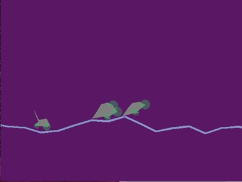
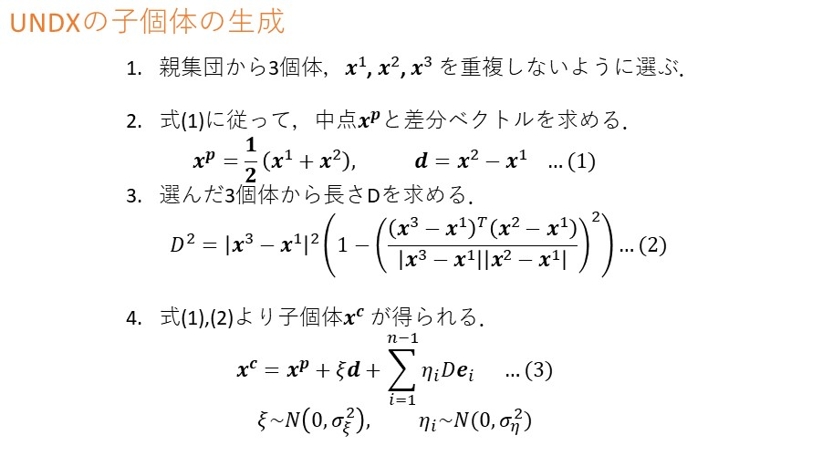

# BoxCar_UNDX

## 作品名
UNDXを用いた車の設計

(実行中の画面)

## 概要
このプログラムは，遺伝的アルゴリズム(GA)の交叉にUNDXを用いて最長の距離を走る車を探索するプログラムである．
設計した車のシミュレーションは，BoxCar2Dを参考にした．車の設計方法として，遺伝的アルゴリズムにUNDXを使用するように実装を行った．

URL：BoxCar2D

http://boxcar2d.com/

## 最適化問題
走行距離を目的関数とし，目的関数を最大化する．
目的関数の値は，シミュレーションによって評価される．

設計変数は以下の20の要素からなる．

0~1: タイヤの半径

2~3: タイヤの配置

4~5: タイヤの密度

6~17: 車体の各頂点座標...(x,y)のセットが6個

18: 車体の密度

19: タイヤの数(0~2)

すべて0~1で正規化されている．
 
## UNDX
Unimodal Normal Distribution Crossover (UNDX)は，交叉を主探索オペレータとして考える．
方法として，3つの親から正規乱数を使用して2つの子個体を生成する．
3つの親のうち，2つの親を結ぶ直線を主探索軸とし，その周辺に子個体が生成される．
詳しいUNDXでの子個体生成式を以下に示す．

## プログラムの構成  
基本的には遺伝的アルゴリズムの流れになっている．

1. 個体集団をランダムに生成．
2. 個体情報から車を設計し，シミュレーションから個体の評価
3. 交叉(UNDX)の適用
4. 突然変異の適用
5. 次世代に残す個体の選択
6. 2~5の操作を収束するまで繰り返す．

## 環境
- ファイル構造
    - src
       - run.py...プログラムを実行するためのもの
       - setting.py...パラメータの値を設定する
       - classes.py...車の設計からシミュレーションまでを記述している

- 実行環境
  - Python 3.7 or 3.6
  - box2d==2.3.10
  - pygame
  - matplotlib

-プログラムの動かし方
  - 実行環境を作成
  - cd [run.pyなど3つのプログラムがある場所]
  - python run.py  を入力
  
## 注意事項
- メッシュの細かい粗い(nelx,nelyの値)はトポロジー設計に影響しない．細かいほどなめらかな結果が得られる．
- 体積分率(volfrac)は指定した長方形の領域に含まれる材料必要(黒色)の割合．
- ペナルティ(penal)は材料必要(黒)・不必要(0)に関わってくる．ペナルティがない(penal = 0.0 ~ 1.0)場合，中間密度が発生し，最終結果にグレーが含まれる．  
     - 推奨値:penal=2.0~3.0
- フィルター解析(rmin)は目的関数値に影響しない．rminを低くすると，よりスムーズなトポロジー解が得られる．

